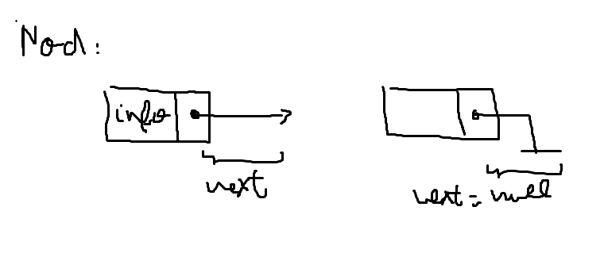
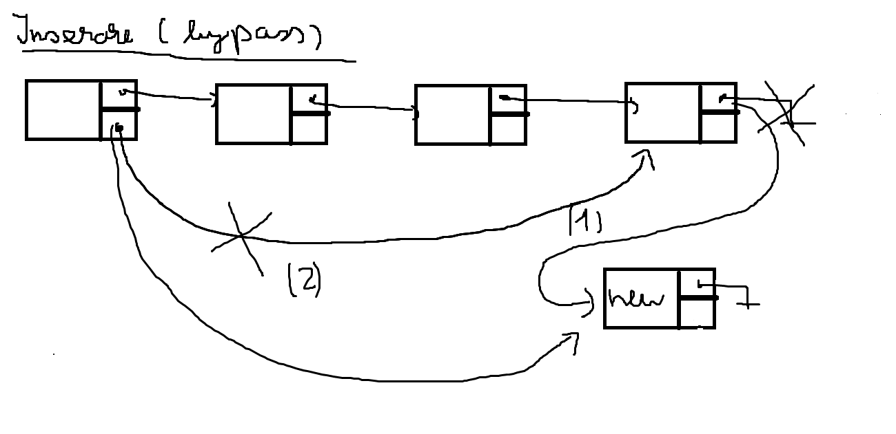

# Linked list
## Ce sunt listele inlantuite si de ce le-as utiliza?
Listele inaltuite sunt o forma de a stoca informatii intr-o zona discontinua din memoria calculatorului.
Vrem sa le utilizam atunci cand avem multe insertii si multe extrageri!
! Cu ele se implementeaza queue si stack. !
Vrem de asemenea sa le utilizam in contextul in care avem matrici zimtate!!
```
Matrice zimtata
0 0 - - - - -
0 0 0 0 - - - 
0 0 - - - - - 
0 0 0 0 0 0 0
0 0 0 - - - -

(Ce este notat cu '-' este de ignorat, garbage information.)
```
## Clasa \vs\ Obiect
Diferenta intre clasa si obiect:
Obiectul este o instanta a clasei.
```
Exemplu:

class Car:
    # ...

Car suzukiSwift
|           |
Clasa       Instanta (obiectul concret)
|
(descrie cum trebuie sa arate o masina)
```
Tu in structurile din C, nu puteai declara functii in declaratia structurilor.
```c++
// NEIN:
struct {
    int x, y
    int functie() { // nu poti declara functii in structuri!!!
        cout << "nu exist"; 
    }

    // bypass bonus:
    int (*func)(); // poti declara un pointer catre o functie...
} ilegal;
```

In python, nu exista conceptul de struct, dar in schimb exista clase!!:D

Discutam VAG, despre POO (nu caca, ci programare orientata pe obiecte)

Am zis mai sus ca o clasa este un "blueprint", adica ea descrie cum trebuie arate orice obiect de tipul ei.
Orice obiect declari sau instantiezi cu clasa respectiva va avea aceleasi atribute si aceleseasi metode.

### Ce este o metoda?
O metoda este o functie a clasei. Se aplica si apeleaza doar cu o instanta.

Exemplu:
```python
class Car:
    def __init__(self):
        pass

    def claxon():
        print("BEEEEEEEEEEEEEEEEEEEEEEP")

suzukiSwift = Car()
suzukiSwift.claxon()

```

## Exemplu discutat:
```python
class Masina:
    model = None

    def __init__(self, model): # Constructor
        self.model = model

    def __str__(self):
        pass

    def claxon(self):
        print("BEEEPP CA UN " + self.model)

class MasinaBombardier(Masina):
    bombardier = None

    def __init__(self, model, bombardier): # Constructor
        self.model = model
        self.bombardier = bombardier

    
suzukiSwift = Masina("swift")
suzukiSwift.claxon()

bmw = MasinaBombardier("bmwseria5", "edypwr")
bmw.claxon()
```

## Cum arata o lista la nivel de implemenatare?
Vom utiliza o clasa pentru implemenare, in C am fi utilizat struct.
Avem 2 campuri importante ale clasei/structurii!!!
Campul de informatie!
Campul de next care in C, este un pointer (adresa) catre urmatoarea celula.
In python, avem direct un camp cu obiect-ul urmator.

Varianta in python:
```python
class myList:
    info = None # Campul de informatie
    next = None # Campul care retine urmatoarea celula, un obiect de tip myList

    def __init__(self, info): # Constructorul listei.
        self.info = info
```
Varianta in C:
```c++
typedef struct node {
    int info;
    node* next;
} *list;
```

## Cum vizualizam o lista?

## Cum inseram intr-o lista? O(n) sau O(1)
```python
class myList:
    info = None # Campul de informatie
    next = None # Campul care retine urmatoarea celula, un obiect de tip myList

    def __init__(self, info): # Constructorul listei.
        self.info = info

def inserare(lista, nod): # O(n)
    while lista.next != None:
        lista = lista.next
    lista.next = nod

def printeazaLista(lista):
    while lista != None:
        print(lista.info, end=' ')
        lista = lista.next

n = int(input())
l = None

while n > 0:
    n -= 1
    x = int(input())

    if l == None:
        l = myList(x)
    else:
        inserare(l, myList(x))
printeazaLista(l)
```

Avem un bypass la inserare care utilizat in stive si cozi!:D
```python
class myList:
    info = None # Campul de informatie
    next = None # Campul care retine urmatoarea celula, un obiect de tip myList
    final = None # Campul care retine ultima celula din myLista

    def __init__(self, info): # Constructorul listei.
        self.info = info
```


## Cum inseram intr-o lista? O(n)
Mai intai vizual!
